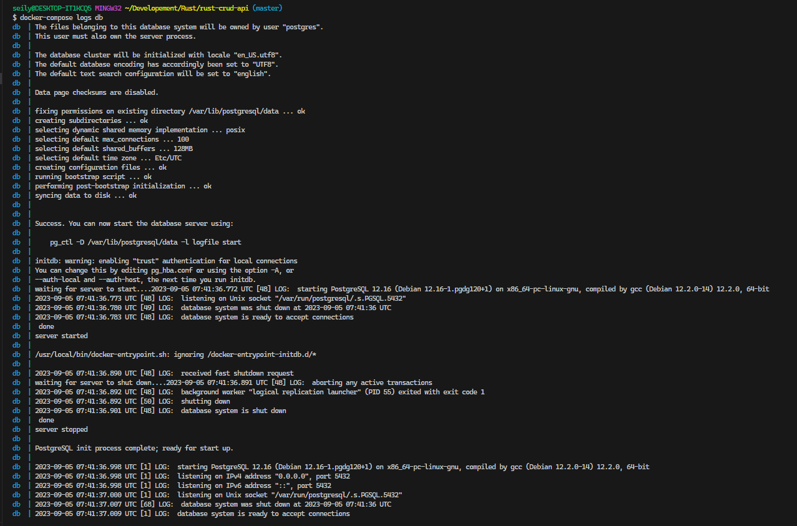

# Build a CRUD REST API in Rust

## Rust server with Docker

- Serde = Serialize and Deserialize JSON
- Postgres
- Docker
- Docker compose

## Introduction


### 1. Create a new Rust Project

```shell
cd Development
mkdir Rust

cargo new rust-crud-api

cd rust-crud-api

code .
```

#### Open the file `Cargo.toml`

```toml
[package]
name = "rust-crud-api"
version = "0.1.0"
edition = "2021"

# See more keys and their definitions at https://doc.rust-lang.org/cargo/reference/manifest.html

[dependencies]
postgres = "0.19"
serde = "1.0"
serde_json = "1.0"
serde_derive = "1.0"
```

- `postgres`: Rust용 Postgres 드라이버.
- `serder`: 직렬화 및 역직렬화를 위한 라이브러리
- `serde-json`: JSON 전용 라이브러리.
- `serde-derive`: Serialize 및 Deserialize 매크로를 파생시키는 라이브러리.

### 2. Dependency

- [x] Dependency를 가져온다.
- [x] 모델(id, name, email)을 생성하고 상수를 추가한다.
- [x] 주요기능: 데이터베이스 연결 및 TCP 서버
- [x] 유틸리티 함수: set_database, get_id, get_user_request_body
- [x] 컨트롤러 함수: handle_get_users, handle_put_user 등

`src/main.rs`

```Rust
use postgres::{ Client, NoTls };
use postgres::Error as PostgresError;
use std::net::{ TcpListener, TcpStream };
use std::io::{ Read, Write };
use std::env;

#[macro_use]
extern crate serde_derive;
```

- `Client`: 데이터베이스에 연결하는데 사용.
- `NoTls`: TLS 없이 데이터베이스 연결하는 데 사용.
- `PostgresError`: Postgres 드라이버가 반환한 오류 유형.
- `TcpListener, TcpStream`: Tcp 서버를 생성.
- `Read`: 환경 변수를 읽는 데 사용.

<details>
  <summary>TLS란?</summary>
<pre>
Transport Layer Security (TLS)는 컴퓨터 네트워크에서 데이터 통신의 보안과 개인 정보 보호를 제공하는 프로토콜입니다. TLS는 웹 브라우징, 이메일, 메시징 애플리케이션 및 다른 네트워크 통신을 보호하는 데 사용됩니다. TLS는 SSL(Secure Sockets Layer)의 후속 버전으로 시작되었으며, 보안 연결을 설정하고 관리하는 데 사용됩니다.
</pre>
</details>

### 3. Make model

`[dependency]` 바로 밑에 작성해준다.

```Rust
//Model: User struct with id, name, email
#[derive(Serialize, Deserialize)]
struct User {
    id: Option<i32>,
    name: String,
    email: String,
}
```

이 모델에 사용자 데이터를 저장해준다.

- `id`: `<i32>`정수이며 선택 사항이다. 그 이유는 새 사용자를 생성하거나 업데이트 할 때 ID를 제공하지 않기 때문이다. 데이터베이스가 자동으로 이를 생성한다.
- `name`: 문자열이며 필수이다. 사용자 이름 저장.
- `email`: 문자열이며 필수이다. 사용자 이메일 저장.

#### constants

```Rust
//DATABASE URL
const DB_URL: &str = env!("DATABASE_URL");

//cosntants
const OK_RESPONSE: &str = "HTTP/1.1 200 OK\r\nContent-Type: application/json\r\n\r\n";
const NOT_FOUND: &str = "HTTP/1.1 404 NOT FOUND\r\n\r\n";
const INTERNAL_ERROR: &str = "HTTP/1.1 500 INTERNAL ERROR\r\n\r\n";
```

- `DB_URL`: 데이터베이스의 URL입니다. 환경 변수에서 이를 읽어보겠습니다. 이 경우 `Content-Type: application/json`응답에 헤더를 추가합니다.
- `OK_RESPONSE`, `NOT_FOUND`, `INTERNAL_ERROR`: 우리가 클라이언트에게 다시 보낼 응답입니다. 상태 코드와 콘텐츠 유형을 반환하는 데 이를 사용합니다.

### 4. Main function

```Rust
//main function
fn main() {
    //Set Database
    if let Err(_) = set_database() {
        println!("Error setting database");
        return;
    }

    //start server and print port
    let listener = TcpListener::bind(format!("0.0.0.0:8080")).unwrap();
    println!("Server listening on port 8080");

    for stream in listener.incoming() {
        match stream {
            Ok(stream) => {
                handle_client(stream);
            }
            Err(e) => {
                println!("Unable to connect: {}", e);
            }
        }
    }
}
```

- `set_database`: 나중에 만들 함수입니다. 데이터베이스에 연결하는 데 사용됩니다.
- `TcpListener::bind`: 포트 8080에서 TCP 서버를 만드는 데 사용됩니다.
- `listener.incoming()`: 들어오는 연결을 얻는 데 사용됩니다.

### 5. Utility

```Rust
//db setup
fn set_database() -> Result<(), PostgresError> {
    let mut client = Client::connect(DB_URL, NoTls)?;
    client.batch_execute(
        "
        CREATE TABLE IF NOT EXISTS users (
            id SERIAL PRIMARY KEY,
            name VARCHAR NOT NULL,
            email VARCHAR NOT NULL
        )
    "
    )?;
    Ok(())
}

//Get id from request URL
fn get_id(request: &str) -> &str {
    request.split("/").nth(2).unwrap_or_default().split_whitespace().next().unwrap_or_default()
}

//deserialize user from request body without id
fn get_user_request_body(request: &str) -> Result<User, serde_json::Error> {
    serde_json::from_str(request.split("\r\n\r\n").last().unwrap_or_default())
}
```

- `set_database`: 데이터베이스에 연결하고 `users`테이블이 없으면 테이블을 생성합니다.
- `get_id`: 요청 URL에서 ID를 가져오는 데 사용됩니다.
- `get_user_request_body`: `Create`및 끝점 에 대한 요청 본문(ID 없음)에서 사용자를 역직렬화하는 데 사용됩니다 `Update`.

### 6. Manage client request

```Rust
//handle requests
fn handle_client(mut stream: TcpStream) {
    let mut buffer = [0; 1024];
    let mut request = String::new();

    match stream.read(&mut buffer) {
        Ok(size) => {
            request.push_str(String::from_utf8_lossy(&buffer[..size]).as_ref());

            let (status_line, content) = match &*request {
                r if r.starts_with("POST /users") => handle_post_request(r),
                r if r.starts_with("GET /users/") => handle_get_request(r),
                r if r.starts_with("GET /users") => handle_get_all_request(r),
                r if r.starts_with("PUT /users/") => handle_put_request(r),
                r if r.starts_with("DELETE /users/") => handle_delete_request(r),
                _ => (NOT_FOUND.to_string(), "404 not found".to_string()),
            };

            stream.write_all(format!("{}{}", status_line, content).as_bytes()).unwrap();
        }
        Err(e) => eprintln!("Unable to read stream: {}", e),
    }
}
```

버퍼를 만든 다음 들어오는 요청에 대한 문자열을 만들어준다.

Rust 명령문을 사용해 `match` 요청을 확인하고 이를 처리할 올바른 함수를 호출할 수 있다.

일치하는 항목이 없으면 `Err(e)` 404 에러를 보낸다.

응답을 클라이언트에 다시 쓰고 오류를 처리하도록 스트림을 설정한다.

### 7. Controller

모두 5개의 엔드포인트 함수가 존재한다.

1. `handle_post_requestCreate`
2. `handle_get_requestRead`
3. `handle_get_all_requestRead All`
4. `handle_put_requestUpdate`
5. `handle_delete_requestDelete`

```Rust
//handle post request
fn handle_post_request(request: &str) -> (String, String) {
    match (get_user_request_body(&request), Client::connect(DB_URL, NoTls)) {
        (Ok(user), Ok(mut client)) => {
            client
                .execute(
                    "INSERT INTO users (name, email) VALUES ($1, $2)",
                    &[&user.name, &user.email]
                )
                .unwrap();

            (OK_RESPONSE.to_string(), "User created".to_string())
        }
        _ => (INTERNAL_ERROR.to_string(), "Internal error".to_string()),
    }
}

//handle get request
fn handle_get_request(request: &str) -> (String, String) {
    match (get_id(&request).parse::<i32>(), Client::connect(DB_URL, NoTls)) {
        (Ok(id), Ok(mut client)) =>
            match client.query_one("SELECT * FROM users WHERE id = $1", &[&id]) {
                Ok(row) => {
                    let user = User {
                        id: row.get(0),
                        name: row.get(1),
                        email: row.get(2),
                    };

                    (OK_RESPONSE.to_string(), serde_json::to_string(&user).unwrap())
                }
                _ => (NOT_FOUND.to_string(), "User not found".to_string()),
            }

        _ => (INTERNAL_ERROR.to_string(), "Internal error".to_string()),
    }
}

//handle get all request
fn handle_get_all_request(_request: &str) -> (String, String) {
    match Client::connect(DB_URL, NoTls) {
        Ok(mut client) => {
            let mut users = Vec::new();

            for row in client.query("SELECT id, name, email FROM users", &[]).unwrap() {
                users.push(User {
                    id: row.get(0),
                    name: row.get(1),
                    email: row.get(2),
                });
            }

            (OK_RESPONSE.to_string(), serde_json::to_string(&users).unwrap())
        }
        _ => (INTERNAL_ERROR.to_string(), "Internal error".to_string()),
    }
}

//handle put request
fn handle_put_request(request: &str) -> (String, String) {
    match
        (
            get_id(&request).parse::<i32>(),
            get_user_request_body(&request),
            Client::connect(DB_URL, NoTls),
        )
    {
        (Ok(id), Ok(user), Ok(mut client)) => {
            client
                .execute(
                    "UPDATE users SET name = $1, email = $2 WHERE id = $3",
                    &[&user.name, &user.email, &id]
                )
                .unwrap();

            (OK_RESPONSE.to_string(), "User updated".to_string())
        }
        _ => (INTERNAL_ERROR.to_string(), "Internal error".to_string()),
    }
}

//handle delete request
fn handle_delete_request(request: &str) -> (String, String) {
    match (get_id(&request).parse::<i32>(), Client::connect(DB_URL, NoTls)) {
        (Ok(id), Ok(mut client)) => {
            let rows_affected = client.execute("DELETE FROM users WHERE id = $1", &[&id]).unwrap();

            //if rows affected is 0, user not found
            if rows_affected == 0 {
                return (NOT_FOUND.to_string(), "User not found".to_string());
            }

            (OK_RESPONSE.to_string(), "User deleted".to_string())
        }
        _ => (INTERNAL_ERROR.to_string(), "Internal error".to_string()),
    }
}
```

- 일부는 `get_id`를 사용해 요청 URL에서 ID를 가져온다.
- `get_user_request_body`함수는 JSON 형식의 요청 본문에서 사용자를 가져와 구조체로 역직렬화하는 데 사용한다.
- 요청이 유효하지 않거나 데이터베이스 연결이 실패한 경우 일부 오류 처리가 있다.

### 8. Docker

우리는 이미지 내부에 직접 Rust 앱을 구축할 것이다. 공식 Rust 이미지를 기본 이미지로 사용할 것이다. 또한 공식 Postgres 이미지를 데이터베이스의 기본 이미지로 사용한다.

- `.dockerignore`: 이미지 파일 시스템에서 복사하고 싶지 않은 파일과 폴더를 무시한다.
- `Dockerfile`: Rust 이미지를 빌드한다.
- `docker-compose.yml`: Rust 및 Postgres 컨테이너를 실행한다.

#### 위의 파일을 생성해준다.

```shell
touch .dockerignore Dockerfile docker-compose.yml
```

#### .dockerignore

```
**/target
```

#### Dockerfile

```Docker
# Build stage
FROM rust:1.69-buster as builder

WORKDIR /app

# accept the build argumment
ARG DATABASE_URL

# make sure to use agg in env
ENV DATABASE_URL=$DATABASE_URL

# Copy the source code
COPY . .

RUN cargo build --release

# production stage
FROM debian:buster-slim

WORKDIR C:\Program Files\Docker\Docker\resources\bin

COPY --from=builder /app/target/release/rust-crud-api .

CMD ["./rust-crud-api"]
```

- `Build`: Rust 앱을 빌드한다.
- `Production`: Rust 앱 실행.

#### docker-compose.yml

```yaml
version: "3.9"

services:
  rustapp:
    container_name: rustapp
    image: francescoxx/rustapp:1.0.0
    build:
      context: .
      dockerfile: Dockerfile
      args:
        DATABASE_URL: postgres://postgres:postgres@db:5432/postgres
    ports:
      - "8080:8080"
    depends_on:
      - db

  db:
    container_name: db
    image: "postgres:12"
    ports:
      - "5432:5432"
    environment:
      - POSTGRES_USER=postgres
      - POSTGRES_PASSWORD=postgres
      - POSTGRES_DB=postgres
    volumes:
      - pgdata:/var/lib/postgresql/data

volumes:
  pgdata: {}
```

우리는 rustapp과 db 두가지 서비스가 있습니다. rustapp 서비스는 이전에 우리가 만든 Docker 파일을 사용하여 구축됩니다.

db 서비스는 공식 Postgres 이미지를 사용합니다. 우리는 rustapp 서비스 전에 db 서비스가 시작되도록 depends_on property를 사용하고 있습니다.

DATABATE_URL build 인수는 postgres://postgres:postgres@db:5432/postgres로 설정되어 있습니다. db는 Postgres 컨테이너의 서비스(및 container_name) 이름이므로 컨테이너 IP 주소로 해결됩니다.

arg 속성을 사용하여 DOCKER 파일에 DATABASE_URL build 인수를 전달합니다.

또한 데이터베이스 데이터를 유지하기 위해 명명된 볼륨인 pg_data를 사용합니다.

### 9. Image build and run container

- 1. postgres container run
- 2. Rust app run
- 3. Rust app container run

#### Postgres container run

```shell
docker-compose up -d db
```

그러면 DockerHub에서 이미지를 가져오고(다운로드) 우리 컴퓨터에서 실행한다.

로그를 보려면 다음을 입력한다.

```shell
docker-compose logs db
```




> > 마지막 줄에 `database system is ready to accept connections` 이 떠야한다.

#### Rust App

이제 Rust app 이미지를 빌드한다.

```shell
docker compose build
```


#### Rust container

```shell
docker compose up rustapp
```

다른 터미널을 열고 다음을 입력해 두 컨테이너 모두 정상적으로 생성된 것을 확인할 수 있다.

```shell
docker ps -a
```


마지막으로 다음을 입력해서 postgres 데이터베이스를 확인할 수 있다.

```shell
docker exec -it db psql -U postgres
\dt
select * from users;
```


### 10. Application test

`Postman`을 사용해 테스트를 진행한다.


